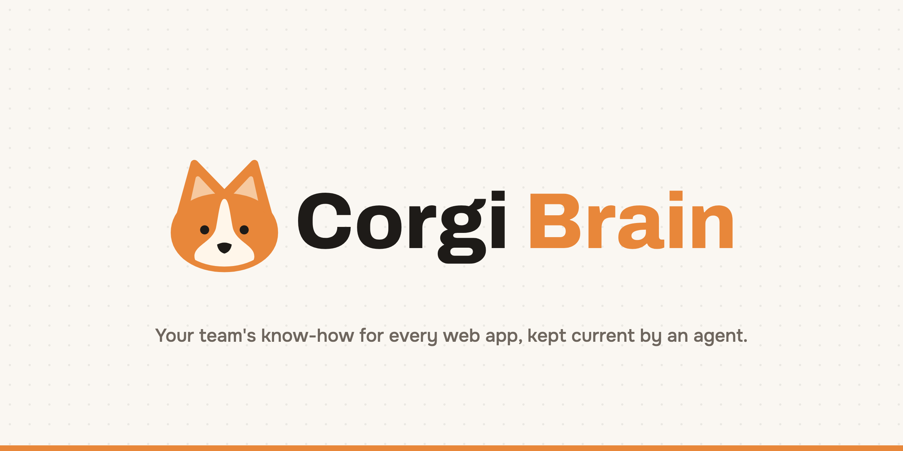
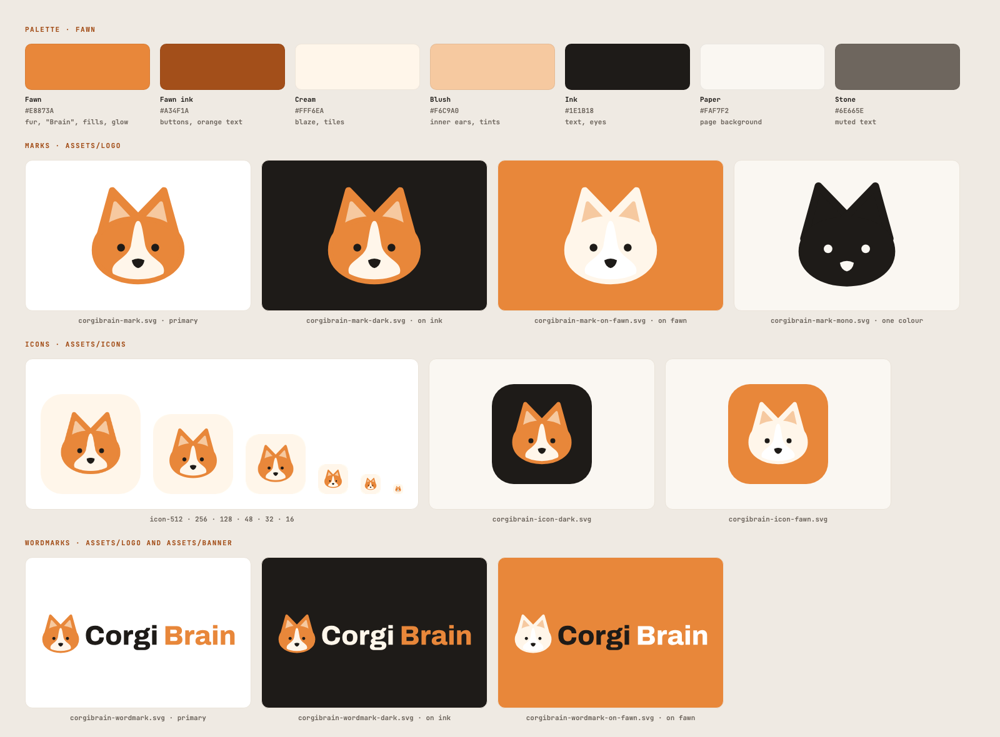

<p align="center"></p>

<p align="center"><b>Your team's know-how for every web app, kept current by an agent.</b></p>

Every team has workflows that live in someone's head: how to add a GitHub secret, where the billing settings are, how to start a return. Corgi Brain learns each one once, then people and agents can ask for it, get guided through it, or have it run for them. An **Agent37 agent** re-checks every workflow overnight, fixes the ones that broke, and posts a morning report, so nobody has to keep the docs up to date by hand.

**Try it:** [Ask room](https://vwnptwlibsllqexidmrj.supabase.co/compute/v1/bridge/ask) · [Discovered](https://vwnptwlibsllqexidmrj.supabase.co/compute/v1/bridge/discovered) · [Replays](https://vwnptwlibsllqexidmrj.supabase.co/compute/v1/bridge/replays)

## The workflow it replaces

Checking that your team's how-to guides still work. Websites change, steps break, and someone has to notice. Corgi Brain's keeper agent does it every night instead.

## How it works

**Teach it.** Record a task once with the Chrome extension (labels and element fingerprints only, never what you type), and Claude cleans it into the shortest path. For public sites you can instead send a team of Claude agents to discover the path; Claude Opus judges each run from its screenshots and catches agents that claim success without getting there.

**Ask it.** In the **Ask room**, a shared team chat, anyone asks "how do I…?". Corgi Brain finds the team's workflows by meaning and Claude answers only from them, citing who taught each one.

**Use it.** Every answer comes with **Guide me** (the extension highlights each step in your own browser), **Run it for me** (replayed in a headless browser in about two seconds, no model calls) and **Add to Claude as a Skill**.

**It keeps itself current.** When a step no longer matches, a Claude agent repairs the path and Opus checks the fix.

## The brain keeper (Agent37)

1. An **Agent37 platform cron** wakes a persistent Hermes agent every morning at 6:00 Pacific. The instance sleeps between runs, so it costs disk only.
2. The agent calls Corgi Brain's `POST /maintenance/check-all`, which replays every workflow agents discovered on public sites and heals the broken ones.
3. The agent reads the results, writes a short morning report, and posts it to the Ask room as *nightly check · Agent37*.

Real run: 16 workflows checked, 12 fine, 1 healed, 3 still broken with the reason for each.

```bash
cd bridge
node scripts/keeper.js setup     # create the Agent37 instance and its nightly cron
node scripts/keeper.js run       # fire it now and follow the agent's turn
node scripts/keeper.js status    # schedule and recent runs
```

## For agents

Corgi Brain is an MCP server. Agents can `ask` the team, `search_workflows`, `get_workflow`, `run_workflow`, `explore_site` and `get_exploration`. A local server for Claude Code is in `mcp/` and registered in `.mcp.json`.

## Stack

| | Used for |
|---|---|
| **Agent37** | The brain keeper: a hosted, sleeping Hermes agent on a platform cron that checks, heals and reports |
| **Claude Sonnet 5.5** | Browser agents, Ask room answers, recording cleanup, self-healing |
| **Claude Opus 5.5** | The judge that scores every agent run from its screenshots |
| **Playwright** | Headless browsers for exploring and replaying |
| **Postgres with vector search** | Workflows, runs and the Ask room; search by meaning |

## Run it yourself

```bash
cd bridge && npm install && npx playwright install chromium
cp .env.example .env      # ANTHROPIC_API_KEY, database URL and keys, KEEPER_TOKEN
npm start                 # http://localhost:8787
```

Load `extension/` unpacked at `chrome://extensions`. For the keeper, add `AGENT37_API_KEY` to `.env.agent37` at the repo root.

## Repo

```
bridge/      the app: pages, API, Claude agents, judge, replay, healing, the keeper endpoints
  scripts/keeper.js   sets up and runs the Agent37 brain keeper
extension/   Chrome extension: record and Guide me
mcp/         MCP server for Claude Code
supabase/    database migrations and edge functions
```

## Privacy

Recordings keep labels and fingerprints, never typed values. Guide me never clicks for you. Agents have no credentials, stop at any login wall, and report bot walls instead of fighting them.

## Brand

Logo, icons, banners and slide-ready PNGs are in [`assets/`](assets/); the rules for using them, for people and agents, are in [STYLE.md](STYLE.md).

<p align="center"></p>
